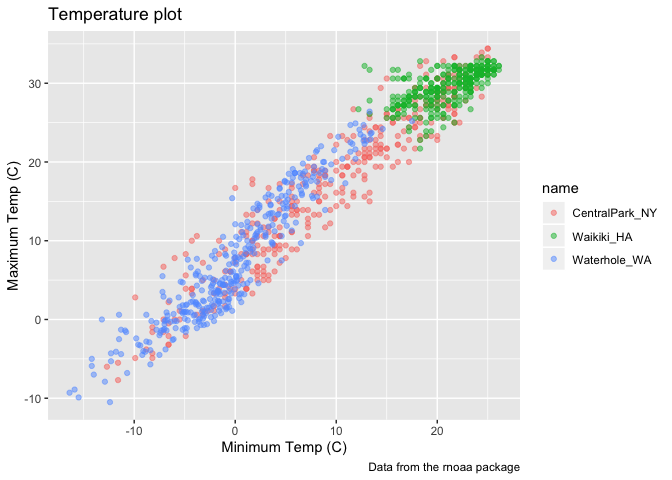
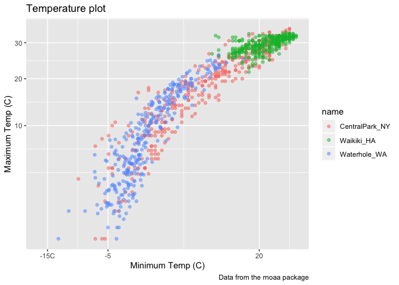
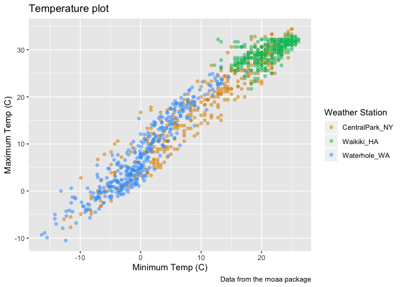
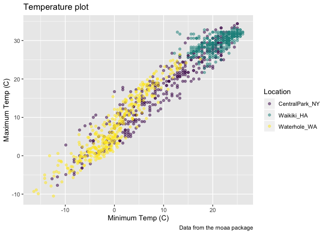
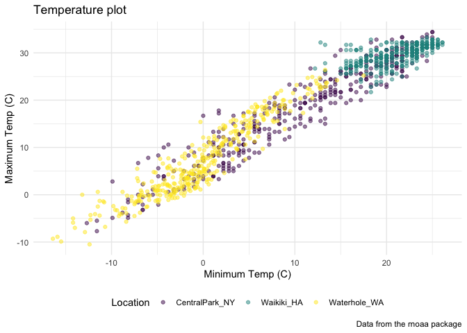

ggplot2
================
Martha Mulugeta
10/1/2019

\#\#create the weather data, cache saves output of code chunk in
directory and doesnt re-download dataset each time; dont worry about it

``` r
weather_df = 
  rnoaa::meteo_pull_monitors(c("USW00094728", "USC00519397", "USS0023B17S"),
                      var = c("PRCP", "TMIN", "TMAX"), 
                      date_min = "2017-01-01",
                      date_max = "2017-12-31") %>%
  mutate(
    name = recode(id, USW00094728 = "CentralPark_NY", 
                      USC00519397 = "Waikiki_HA",
                      USS0023B17S = "Waterhole_WA"),
    tmin = tmin / 10,
    tmax = tmax / 10) %>%
  select(name, id, everything())
```

    ## Registered S3 method overwritten by 'crul':
    ##   method                 from
    ##   as.character.form_file httr

    ## Registered S3 method overwritten by 'hoardr':
    ##   method           from
    ##   print.cache_info httr

    ## file path:          /Users/marthamulugeta/Library/Caches/rnoaa/ghcnd/USW00094728.dly

    ## file last updated:  2019-09-26 10:25:45

    ## file min/max dates: 1869-01-01 / 2019-09-30

    ## file path:          /Users/marthamulugeta/Library/Caches/rnoaa/ghcnd/USC00519397.dly

    ## file last updated:  2019-09-26 10:26:01

    ## file min/max dates: 1965-01-01 / 2019-09-30

    ## file path:          /Users/marthamulugeta/Library/Caches/rnoaa/ghcnd/USS0023B17S.dly

    ## file last updated:  2019-09-26 10:26:06

    ## file min/max dates: 1999-09-01 / 2019-09-30

## making new plots

start with an old plot\!

``` r
weather_df %>% 
  ggplot(aes(x = tmin, y = tmax)) + 
  geom_point(aes(color = name), alpha = .5)
```

    ## Warning: Removed 15 rows containing missing values (geom_point).

<!-- -->

add lables:

``` r
weather_df %>% 
  ggplot(aes(x = tmin, y = tmax)) + 
  geom_point(aes(color = name), alpha = .5) +
  labs(
    title = "Temperature plot",
    x = "Minimum Temp (C)",
    y = "Maximum Temp (C)",
    caption = "Data from the rnoaa package"
  )
```

    ## Warning: Removed 15 rows containing missing values (geom_point).

<!-- -->

x axis tick marks etc

``` r
weather_df %>% 
  ggplot(aes(x = tmin, y = tmax)) + 
  geom_point(aes(color = name), alpha = .5) +
  labs(
    title = "Temperature plot",
    x = "Minimum Temp (C)",
    y = "Maximum Temp (C)",
    caption = "Data from the rnoaa package"
  ) +
  scale_x_continuous(
    breaks = c(-15, -5, 20),
    labels = c("-15C", "-5", "20")
  ) +
  scale_y_sqrt()
```

    ## Warning in self$trans$transform(x): NaNs produced

    ## Warning: Transformation introduced infinite values in continuous y-axis

    ## Warning: Removed 90 rows containing missing values (geom_point).

<!-- -->

\#\#colors

change default colors that ggplot uses; use sclae color function; don’t
really need to do this

``` r
weather_df %>% 
  ggplot(aes(x = tmin, y = tmax)) + 
  geom_point(aes(color = name), alpha = .5) +
  labs(
    title = "Temperature plot",
    x = "Minimum Temp (C)",
    y = "Maximum Temp (C)",
    caption = "Data from the rnoaa package"
  ) +
  scale_color_hue(
    name = "Weather Station",
    h = c(50, 250)
  )
```

    ## Warning: Removed 15 rows containing missing values (geom_point).

<!-- -->

viridis package

``` r
ggp_base = 
weather_df %>% 
  ggplot(aes(x = tmin, y = tmax)) + 
  geom_point(aes(color = name), alpha = .5) +
  labs(
    title = "Temperature plot",
    x = "Minimum Temp (C)",
    y = "Maximum Temp (C)",
    caption = "Data from the rnoaa package"
  ) +
   viridis::scale_color_viridis(
    name = "Location", 
    discrete = TRUE
  )

ggp_base
```

    ## Warning: Removed 15 rows containing missing values (geom_point).

<!-- -->

## Overarching themes go first (i.e. bw, minimal), then tweaks in theme go next

``` r
ggp_base +
  theme_minimal() +
  theme(legend.position = "bottom")
```

    ## Warning: Removed 15 rows containing missing values (geom_point).

<!-- -->
